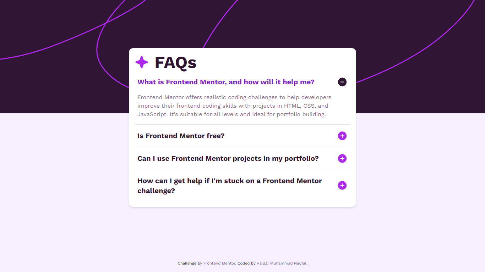

# Frontend Mentor - FAQ accordion solution

This is a solution to the [FAQ accordion challenge on Frontend Mentor](https://www.frontendmentor.io/challenges/faq-accordion-wyfFdeBwBz). Frontend Mentor challenges help you improve your coding skills by building realistic projects.

## Table of contents

- [Overview](#overview)
  - [Screenshot](#screenshot)
  - [Links](#links)
- [My process](#my-process)
  - [Built with](#built-with)
  - [What I learned](#what-i-learned)
- [Author](#author)

## Overview

### Screenshot

### Links

- Live Site URL: [Add live site URL here](https://haidarmn.github.io/faq-accordion)

## My process

### Built with

- HTML5
- JavaScript
- TailwindCSS

### What I learned

To dynamicly change the plus/minus icon and show the content

## Author

- Website - [Haidar Muhammad Naufal](https://haidarmn.github.io)
- Frontend Mentor - [@HaidarMN](https://www.frontendmentor.io/profile/HaidarMN)
